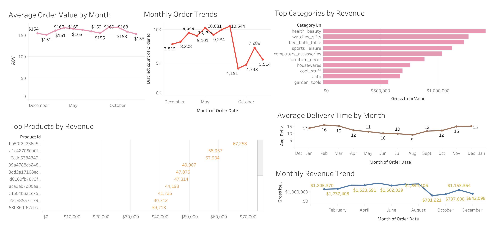
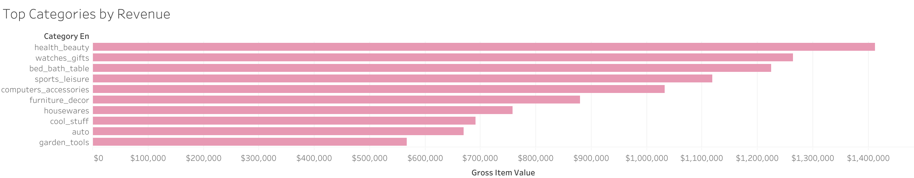

# retail-kpi-dashboard
End-to-end retail analytics project using BigQuery and BI dashboards. Includes raw → staging → star schema modeling, KPI SQL, and insights.

# Retail Performance Dashboard (BigQuery + SQL + Tableau)

End-to-end analytics project using the **Brazilian E-Commerce (Olist)** dataset.  
Built a **star-schema** model in **BigQuery**, defined KPI logic in SQL, and created an interactive **Tableau** dashboard with trends and performance breakdowns.

## Tableau Dashboard
- **Tableau Public:** (https://public.tableau.com/views/Olist_17676666794640/RetailPerformanceDashboard-OlistBigQuerySQL_1?:language=en-GB&publish=yes&:sid=&:redirect=auth&:display_count=n&:origin=viz_share_link)


## Screenshots
## Dashboard Overview


## Revenue & Orders Trends


## Customer Value


## Operations


## Product Performance



### Operations Trends


## Tech Stack
- **BigQuery** (raw → staging → marts)
- **Google Cloud Storage** (CSV staging for BigQuery load)
- **Tableau** (dashboard + visuals)
- **Git + GitHub** (reproducible SQL pipeline)

## Data Model (Star Schema)
### Facts
- `olist_marts.fact_order_items`  
  Grain: **1 row per order item**  
  Used for: revenue, category/product performance, AOV inputs  
- `olist_marts.fact_orders`  
  Grain: **1 row per order**  
  Used for: order counts, delivery time, cancellation rate

### Dimensions
- `olist_marts.dim_product` (category + product attributes)
- `olist_marts.dim_date` (calendar attributes)

## KPIs Implemented (SQL)
- Revenue (Delivered Orders)
- Orders
- Average Order Value (AOV)
- Average Delivery Time (days)
- Cancellation Rate
- Top Categories / Top Products

KPI queries live in: `sql/kpis/`

## Repository Structure
```text
.
├── sql/
│   ├── staging/
│   ├── marts/
│   ├── kpis/
│   └── quality/ (optional)
├── docs/
├── images/
└── README.md

